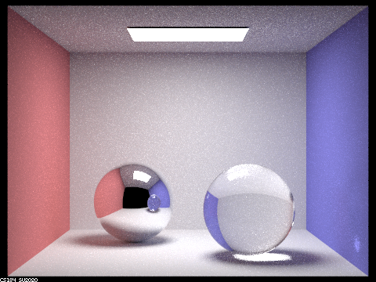
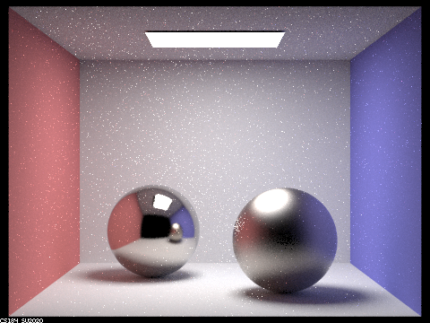
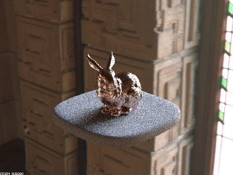

# Assignment 6

Name: An Zihang

Student ID: 121090001

## 0. Abstract

In this project, we expand the range of materials from diffuse materials to various materials. As we know, the features of each material are represented by its BSDF, so the main topic here is how to implement the BSDFs of the materials.

Also, we introduce environment light and depth of the field in this project to make our scenes whole and realistic.

## 1. BSDF for Mirror and Glass Materials

In this part, we assume the mirror is ideally reflective. So for given outgoing ray $\omega_o$, we can easily obtain the coordinates of the corresponding incident ray $\omega_i$ in the **object coordinate space**:

```c++
*wi = Vector3D(-wo.x, -wo.y, wo.z);
```

Thus the BRSF of perfect mirror is easy to get:

```c++
Vector3D MirrorBSDF::sample_f(const Vector3D wo, Vector3D* wi, double* pdf) {
    *pdf = 1.0;
    reflect(wo, wi);
    return reflectance / abs_cos_theta(*wi); // perfect mirror consumes no energy
}
```

And for glass material, we take refraction into consideration. Light not only refracts but also reflects.


Given the index of refraction, we can get the $\omega_i$ corresponding to $\omega_o$ via Snell's law:

```c++
double eta = wo.z > 0 ? 1.0 / ior : ior,
	   k = 1 - eta*eta*(1-wo.z*wo.z);
if (k < 0) // total reflection
    return false;
// Snell's law
*wi = Vector3D(-eta * wo.x, -eta * wo.y, (wo.z < 0 ? 1.0 : -1.0) * sqrt(k));
```

The total radiance is divided into two parts when a ray hits the glass material, that is, the part of reflection and the part of refraction. To set a proper ratio of the two parts, we need to use Schlick's approximation:

```c++
Vector3D GlassBSDF::sample_f(const Vector3D wo, Vector3D* wi, double* pdf) {
    double eta = wo.z > 0 ? 1.0 / ior : ior,
    	   check_total_ref = 1 - eta*eta*(1-wo.z*wo.z);

    if (check_total_ref < 0) {
        *wi = wo;
        *pdf = 1;
        return reflectance / abs_cos_theta(*wi);
    }

    refract(wo, wi, ior); // give value to wi
    
	// Schlick's approximation
    double R0 = pow((1-eta) / (1+eta), 2),
    	   R = R0 + (1-R0) * pow(1 - abs_cos_theta(*wi), 5); 
	
    // Ratio of the two parts
    if (coin_flip(R)) {
        reflect(wo, wi);
        *pdf = R;
        return R * reflectance / abs_cos_theta(*wi);
    }
    else {
        refract(wo, wi, ior);
        *pdf = 1 - R;
        return (1-R) * transmittance / abs_cos_theta(*wi) / pow(eta, 2);
    }
}
```

After we combine the reflection and refraction, we can get very realistic glass effect:



When we reduce the maximum depth of ray, we can get different effect:


The pictures above are maximum depth from 100 down to 0. When $max\_ray\_depth < 5$, the image becomes darker.

And when $max\_ray\_depth = 2$, we can see the front glass sphere is very dark. That is because the refraction takes at least 2 bounces, i.e. entering and exiting the sphere. So the rays from the light cannot **enter the sphere, exit the sphere, hit the ground** and go into the camera, which takes 3 bounces. the only things we can see on the glass sphere are the highlight and reflected surfaces. Also, the roof, reflected on the chrome sphere, becomes dark.

When $max\_ray\_depth = 1$, we can only see the highlight on the spheres. When it comes to 0, we can only see the light itself.

## 2. BSDF for Microfacet Material

To consider the roughness of the surface, we use microfacet material. That is, the reflectance is determined by the total effect of the microfacets of the material, and the microfacets are considered perfectly specular. The microfacet BSDF looks like:
$$
f(\omega_i, \omega_o) = 
\dfrac{F(\omega_i)G(\omega_i,\omega_o)D(h)}
{4\times(n\cdot \omega_i)\times(n\cdot \omega_o)}
$$


$F(\omega_i, h)$: The Fresnel term, which describes the relation of reflection and refraction;

$G(\omega_i, \omega_o, h)$: The shadowing-masking term, which describes the occlusion relation between the microfacets;

$D(h)$: The distribution of the normals of the microfacets.

We have the following implementations of the functions above:

```c++
Vector3D MicrofacetBSDF::F(const Vector3D wi) {
    double cos_theta_i = cos(getTheta(wi));
    Vector3D Rs = ((eta*eta + k*k) - 2*eta*cos_theta_i + pow(cos_theta_i, 2)) /
        		  ((eta*eta + k*k) + 2*eta*cos_theta_i + pow(cos_theta_i, 2)),
    Rp = ((eta*eta + k*k) * pow(cos_theta_i, 2) - 2*eta*cos_theta_i + 1) /
         ((eta*eta + k*k) * pow(cos_theta_i, 2) + 2*eta*cos_theta_i + 1); 
    return (Rs + Rp) / 2;
}

double MicrofacetBSDF::G(const Vector3D wo, const Vector3D wi) {
    return 1.0 / (1.0 + Lambda(wi) + Lambda(wo));
}

double MicrofacetBSDF::D(const Vector3D h) {
  double roughness = alpha, // adjustable
      	 numer = exp(-pow(tan(getTheta(h)) / roughness, 2)),
         denom = PI * pow(roughness, 2) * pow(cos(getTheta(h)), 4);

  return numer / denom;
}
```

Here we use Beckmann distribution for $D(h)$, and we need to do importance sampling rather than hemisphere uniform sampling to fit the distribution. We sample $\theta$ and $\phi$ according to pdfs $p_\theta(\theta_h) $ and $p_\phi(\phi_h)$. Using some ways to make them resemble $D(h)$, we can get the following implementation which has little noise:

```c++
Vector3D MicrofacetBSDF::sample_f(const Vector3D wo, Vector3D* wi, double* pdf) {
    Vector2D rand = sampler.get_sample();
    double r1 = rand.x,
    	   r2 = rand.y,
    	   theta_h = atan(sqrt(-pow(alpha, 2) * log(1-r1))),
    	   phi_h = 2 * PI * r2;

    Vector3D h = Vector3D(sin(theta_h) * cos(phi_h), sin(theta_h) * sin(phi_h), cos(theta_h));
    *wi = wo + 2 * (dot(wo, h)*h - wo);

    double p_theta = 2 * sin(theta_h) * exp(-pow(tan(theta_h), 2) / pow(alpha, 2)) / 
        			 (pow(alpha, 2) * pow(cos(theta_h), 3)),
    	   p_phi = 1.0 / (2 * PI),
    	   p_w_h = p_theta * p_phi / sin(theta_h),
    	   p_w_wi = p_w_h / (4 * dot((*wi), h));

    if (wi->z > 0 && wo.z > 0) { // validate the coordinates
        *pdf = p_w_wi;
        return MicrofacetBSDF::f(wo, *wi);
    }
    *wi = cosineHemisphereSampler.get_sample(pdf);
    return Vector3D();
}
```

After this part, we can render some scenes with microfacet materials, and adjust the $\alpha$ value to control the roughness of the object:


The pictures above are rendered with roughness 0.005, 0.05, 0.25 and 0.5. From the formular of $D(h)$ we can get $\displaystyle{\lim_{\alpha \rightarrow 0} D(h) = 0}$, and increases on (0, 1), so f also increases. The smaller $\alpha$ is, the more glossy the result is; the larger $\alpha$ is, the more diffuse the result is.

The effect looks good, we have another example here:


But if we do not use importance sampling, it may look like this:


It looks pretty like when $\alpha=0$ under importance sampling. When we sample on a hemisphere uniformly, it means the material is infinitely diffuse, which is equivalent to $\alpha=0$ for the importance sampling.

We can also render many other materials using microfacet model (left one with $\alpha = 0.025$ and the right one with $\alpha=0.25$):


These left sphere above is of aluminum ($Al$) material, and the right one is of silver ($Ag$) material. We can modify their materials to be cobalt ($Co$) and bismuth ($Bi$):



The color of cobalt and bismuth is a little darker than aluminum and silver. We can even modify them to be coper ($Cu$) and ferric oxide ($Fe_2O_3$):


## 3. Environment Light

In this part, we are using the **ennis.exr**, which looks like this:


with a probability debug image:


In real world, there is often radiance from the sources other than the light bulbs, such as the sun. The environment where the scene locates can provide radiance from all directions due to the sunlight. In that case, we introduce the environment light to involve this kind of radiance.

Briefly, environment light is an infinitely far away source, giving incident radiance from all directions around the scene. And when we are trying to get radiance on some point, we need to map the environment light to a texture map and sample it with parameters $\theta$ and $\phi$. As before, we have two ways to do sampling, uniform sampling and importance sampling.

#### Uniform Sampling

For uniform sampling, we just sample the incident ray direction uniformly on the sphere, and convert the $\theta-\phi$ coordinates to $x-y$ coordinates, and use bilinear interpolation to sample the texture map to get the radiance.

```c++
*wi = sampler_uniform_sphere.get_sample();
*distToLight = INF_D;
*pdf = 1.0 / (4.0 * PI);
Vector2D phi_theta = dir_to_theta_phi(*wi),
		 x_y = theta_phi_to_xy(phi_theta);
return bilerp(x_y);
```

with uniform sampling, we can get effects like this:


we can see the light come through the glass and generates the shadow in front of the bunny. And if the bunny is of microfacet model (with a coper material), it looks like this:



Obviously, there is a lot of noise on the bunny as well as the pedestal, which we used to encounter in path tracing. At that time, we used importance sampling to sample the incident ray direction to solve the problem, here we can do similar things to have a try.

#### Importance Sampling

Consider our real life, when you look to the direction of the sun, the light can be so harsh that you cannot even open your eyes. But when you look at the grass on the ground, the light is much softer. Things are the same for our environment light. Much of the radiance is concentrated near the direction of the light source, and we can do importance sampling according to this.

First, we assign a probability to all pixels on texture map with respect to the energy passing through that solid angle. Then we can calculate cumulative distribution along two axis, i.e. we first calculate $F_y(j)$ for sampling y, then we calculate $F_{x|y}(i|j)$ to sample x given the sampled y.

After initialization of the two CDFs, we can do importance sampling. First randomly sample two numbers $sx,\ sy$ in [0,1] as "the threshold of the CDF when we sample" along the two axis. That is how we realize the "importance" sampling. Because the CDF has larger probability to reach the threshold at an area where energy concentrates, so we will have larger probability to sample x and y at those areas.

```c++
Vector2D sample = sampler_uniform2d.get_sample();
int y = std::upper_bound(marginal_y, marginal_y + envMap->h, sample.y) - marginal_y,
	x = std::upper_bound(conds_y + envMap->w*y, conds_y + envMap->w*(y+1), sample.x) 		 - (conds_y + envMap->w*y);

*wi = theta_phi_to_dir(xy_to_theta_phi(Vector2D(x, y)));
*distToLight = INF_D;
*pdf = pdf_envmap[envMap->w * y + x] * envMap->w * envMap->h / 
       (2*PI*PI * sin(xy_to_theta_phi(Vector2D(x, y)).x));

return envMap->data[envMap->w * y + x];
```

Using importance sampling, we can get effects like these:


Obviously, there are less noise, and the surface of the bunny looks more smooth.

## 4. Depth of Field

By now, the major difference of the render result and the real world camera photograph is that we are using a pinhole camera. That means we do not support depth of field and everything is in focus. In this part we simulate rendering using a thin lens to get an effect of depth of field.

With a lens, only the points that are **focalDistance** away from the lens are in focus. The other points look not as clear as those points.


Due to the property of lens, **the rays going through the center of the lens do not change their direction**. We can use this property to find the point on the plane of focus. Also, when we cast **other sample rays from the same pixel that go through the lens, after refraction, they will also hit the same point on the plane of focus**. With these properties, we can realize a thin lens in front of the image plane.

Specifically, for any point on the image plane, we can find the corresponding point $pFocus$ on the plane of focus using the first property, then we cast sample rays to the lens and get intersection $pLens$, then the ray direction between the lens and the plane of focus is $pFocus-pLens$ . After normalization and conversions, we get the accurate radiance.

```c++
Ray Camera::generate_ray_for_thin_lens(double x, double y, double rndR, double rndTheta) const {
    double nwidth = 2 * tan(radians(hFov/2)), nheight = 2 * tan(radians(vFov/2));
    double nx = x * nwidth, ny = y * nheight;
    nx -= tan(radians(hFov/2)); ny -= tan(radians(vFov/2));

    Vector3D pLens = Vector3D(lensRadius * sqrt(rndR) * cos(rndTheta),
                              lensRadius * sqrt(rndR) * sin(rndTheta),
                              0);
    Vector3D pFocus = Vector3D(focalDistance * nx, focalDistance * ny, -										   focalDistance);
    Ray res = Ray(pos + c2w * pLens,
                  (c2w * (pFocus-pLens)).unit());
    res.min_t = nClip;
    res.max_t = fClip;
    return res;
}
```

If we maintain the radius of the lens and change the focal distance, we can focus on different places of the scene:


The pictures above use lens of radius **1.1**, and focus on the head, middle, tail of the dragon ($\alpha=0.15$), as well as the corner of the box.

We can also control focal distance and change the radius of lens:


The pictures above  all focus on the forehead of lucy ($\alpha=0.17$), with **lensRadius** 0.005, 0.05, 0.1, 0.2. As we can see, when $lensRadius=0.005$, it is close to the pinhole camera, with little depth of field effect. When it comes to 0.05, the effect is much more obvious, anything too far or too close is blurred. And when the radius comes to 0.1 or even 0.2, basically everything out of the plane of focus is blurred. So at this focal distance, a radius around 0.04 or 0.05 is preferred.